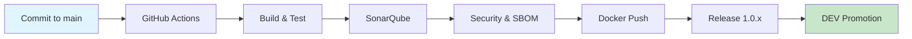

# Adrian Java App – Application Repository

This repository contains Java Spring Boot application code. CI/CD pipeline is powered by centralized reusable workflows from [ci-cd-templates](https://github.com/Adrian-CICD-Project/ci-cd-templates).

## CI Pipeline Scope

The pipeline handles:

- **Build and test** Java application
- **Code quality analysis** using SonarQube
- **Security scanning** with Trivy
- **SBOM generation** in CycloneDX format
- **Docker image build and publish** to Azure Container Registry (ACR)
- **Automatic promotion** to DEV environment (GitOps with ArgoCD)

---

## CI Pipeline – GitHub Actions

The pipeline runs automatically after every push to the `main` branch.

> **Note:** Pipeline logic is defined in [ci-cd-templates/java-ci-full.yml](https://github.com/Adrian-CICD-Project/ci-cd-templates/blob/main/.github/workflows/java-ci-full.yml). This repo only contains trigger configuration and variables.

### Execution Stages

| Stage | Description |
|-------|-------------|
| **Build & Test** | Runs `mvn clean verify`, test artifacts available in GitHub Actions |
| **SonarQube** | Code quality scan and analysis |
| **Security & SBOM** | Trivy scan, CycloneDX SBOM generation, Dependency-Track upload |
| **Docker Build** | Image build with semantic version tag (1.0.x), push to ACR |
| **GitHub Release** | Automatic release with attached SBOM and Trivy report |
| **Promotion to DEV** | PR creation to `infrastructure-env-dev`, ArgoCD rollout |

---

## CI/CD Flow Diagram

---

## pom.xml Configuration

When deploying a new application, ensure your `pom.xml` includes:

| Requirement | Description |
|-------------|-------------|
| `groupId` / `artifactId` | Proper project identifiers |
| Java version | Must match Dockerfile (currently Java 21) |
| `spring-boot-starter-test` | Required for testing |
| `jacoco-maven-plugin` | Code coverage (required by SonarQube) |
| `sonar-maven-plugin` | SonarQube integration |

> **Detailed guide:** [docs/DEVELOPER_GUIDE_POM.md](docs/DEVELOPER_GUIDE_POM.md)

---

## Related Repositories

| Repository | Purpose |
|------------|---------|
| `adrian-java-app` | Java Spring Boot Application (this repo) |
| `ci-cd-templates` | **Centralized CI/CD workflow templates** |
| `infrastructure-env-dev` | ArgoCD configuration for DEV environment |
| `infrastructure-env-test` | ArgoCD configuration for TEST environment |
| `infrastructure-env-prod` | ArgoCD configuration for PROD environment |

---

## Notes

- Pipeline is fully automated – every commit to `main` triggers the entire process
- Dockerfile should be located in the repository root
- Azure Container Registry (ACR) must be configured with necessary permissions
- ArgoCD monitors changes in `infrastructure-env-*` repositories and synchronizes application state automatically

## END